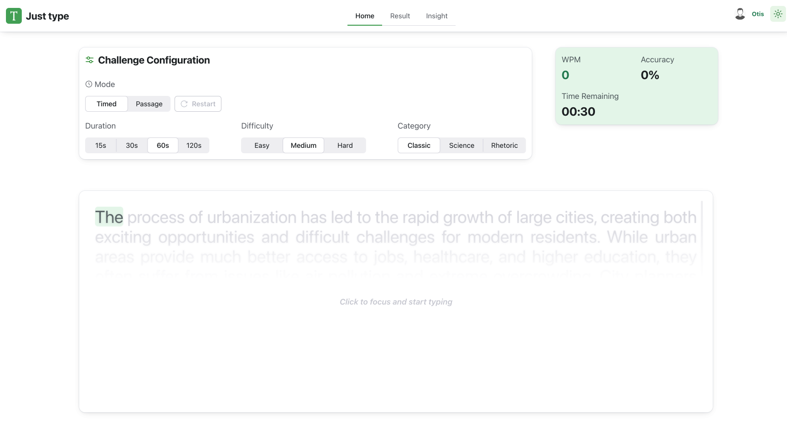

# Typing Speed Test App (Frontend Practice Project)

Solution for a **Typing Speed Test** application built with modern React tooling, focusing on performance, clean UI, and developer experience.

## Table of Contents

- [Overview](#overview)
  - [Screenshot](#screenshot)
  - [Links](#links)
- [Features & Tech Stack](#features--tech-stack)
- [Getting Started](#getting-started)
- [Author](#author)

## Overview

Typing Speed Test is a web application that helps users measure and improve their typing speed and accuracy.  
The app provides real-time feedback, detailed statistics, and visual insights to help users track and analyze their typing performance over time.

### Screenshot



### Links

- [Solution URL](https://github.com/leminhhieu98py/typing-speed-test-app)
- [Live Site URL](https://just-type-vn.netlify.app/)

## Features & Tech Stack

- **React 19** for building modern, high-performance user interfaces
- **TanStack React Router** for type-safe and scalable routing
- **Radix UI** for accessible, lightweight UI primitives
- **CSS Modules** (`.module.css`) for scoped and maintainable styles
- **Recharts** for visualizing typing speed, accuracy, and insights
- **RSBuild** for fast development and optimized production builds
- **Bun** as the JavaScript runtime and package manager
- **Lefthook** for Git hooks and code quality automation
- **Automated CD** with Netlify for continuous deployment

## Getting Started

### Prerequisites

- **Bun** (latest stable version)
- Node.js (compatible with Bun)

### Local Development

1. Install dependencies:
   ```bash
   bun install
   ```
2. Start the development server:
   ```bash
   bun run dev
   ```
3. Build for production:
   ```bash
   bun run build
   ```

## Author

- **Le Minh Hieu (Otis)**: [LinkedIn](https://www.linkedin.com/in/hi%E1%BA%BFu-l%C3%AA-minh-7996bb153/)
- **Frontend Mentor**: [leminhhieu98py](https://www.frontendmentor.io/profile/leminhhieu98py)
